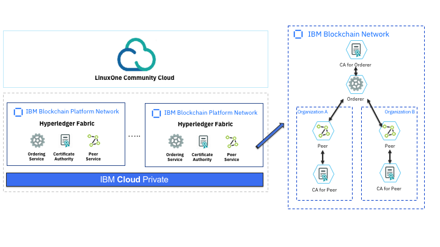
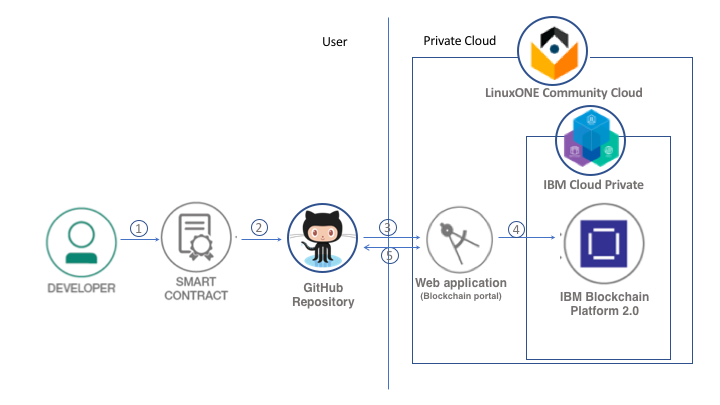
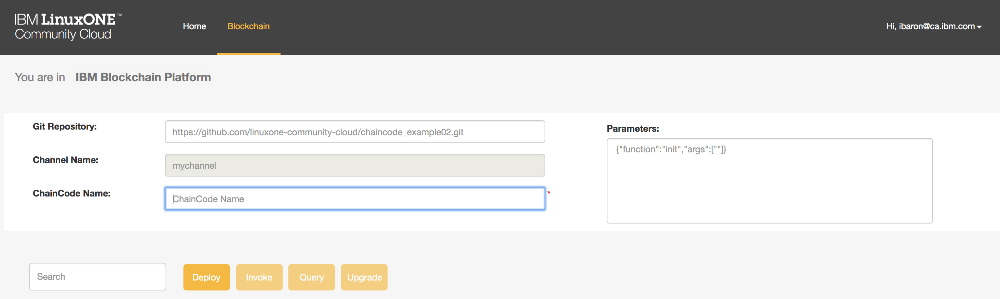
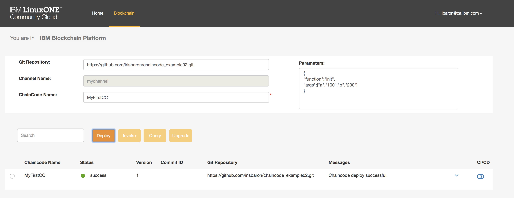
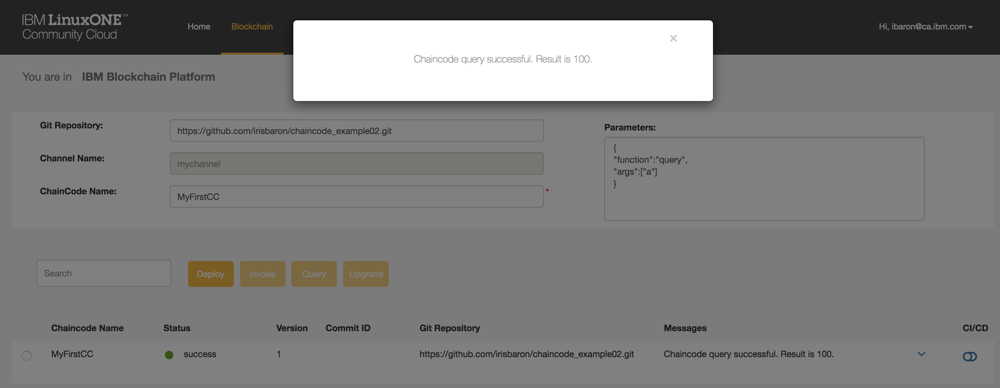
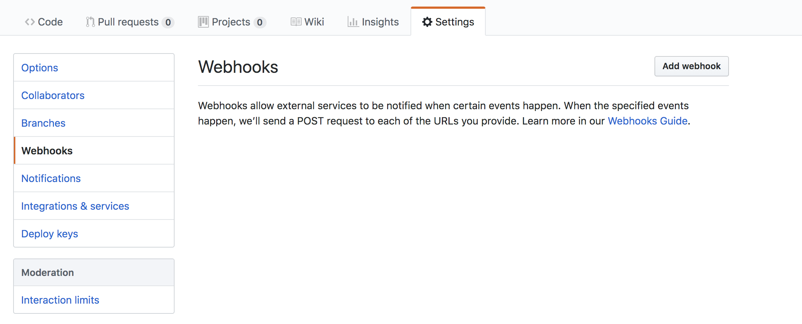
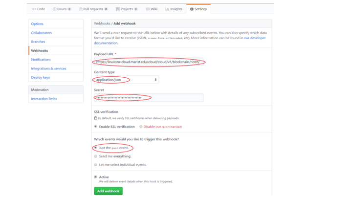
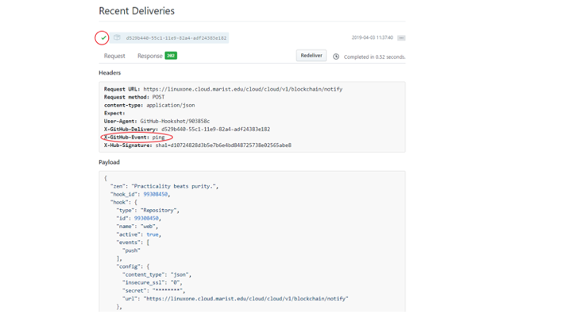
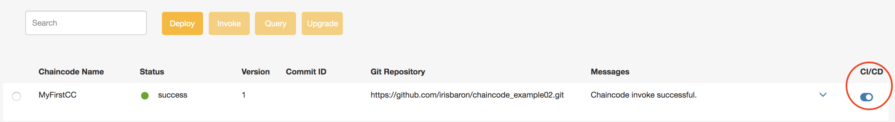
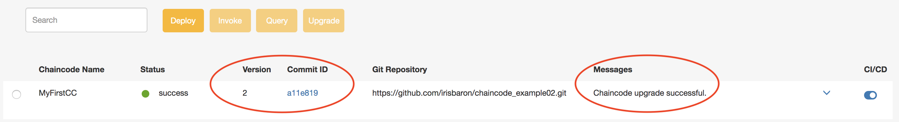

# Use CI/CD to Deploy a Chaincode to Blockchain in a Private Cloud on LinuxONE

This code pattern demonstrates an easy deployment of a chaincode from GitHub to a blockchain network setup on IBM Blockchain Platform for IBM Cloud Private on LinuxONE with simple continuous integration and continuous delivery (CI/CD) pipeline. 

IBM Blockchain Platform for IBM Cloud Private is an offering based on Kubernetes, that simplifies deployment of essential elements of a blockchain network in your own infrastructure through IBM Cloud Private (ICP). There are many advantages to running your blockchain networks on premises, such as increased security, robustness, locality of data and the ability to address market regulation requirements.

You will use a predefined and configured setup of a blockchain network running on IBM Blockchain Platform for IBM Cloud Private on the LinuxONE Community Cloud. The network is based on Hyperledger Fabric v1.2.1 and contains one orderer, two peers and three certificate authorities (CA).

<p align="center">
  
</p>

A provided web application, in a simple and intuitive GUI format, allows the users to interface the blockchain network, to deploy the chaincode, and to query and perform transactions. In its basic mode, the deployment uses the ‘fetch’ function to retrieve the code from GitHub.

In addition, the web application allows you to experiment with a simple CI/CD pipeline to automate tracking chaincode changes and deployments of new versions, using the CI/CD function of GitHub. 

This code pattern can later be used as the foundation to your required needs; the sample chaincode can be modified or replaced with your chaincode, and the CI/CD component provided here can be replaced with commonly used tools such as Jenkins, which requires more experience.

# Architecture flow
<p align="center">
  
</p>

1. The user obtains a sample chaincode (smart contract)
2. The user creates a local GitHub repository with the chaincode
3. The user accesses the web application GUI on LinuxONE Community Cloud to interface IBM Blockchain Platform for ICP 
4. The user deploys the chaincode to a pre-set blockchain network and invokes transactions and query operations
5. The user enables and tests CI/CD automation (optional)

# Included components
[IBM Blockchain Platform for IBM Cloud Private](https://console.bluemix.net/docs/services/blockchain/ibp_for_icp_deployment_guide.html#get-started-icp) - allows deployment and control of blockchain networks in your own infrastructure through Cloud Private


# Included Technologies
[IBM LinuxONE](https://www.ibm.com/it-infrastructure/LinuxONE) - a server designed to support and exploit Linux, based on Mainframe architecture

[IBM Cloud Private](https://www.ibm.com/cloud/private) - a private cloud platform that provides the benefits of the public cloud but runs on-premises

[IBM Blockchain](https://www.ibm.com/blockchain) -  a shared, immutable, digital ledger based on [hyperledger fabric](https://www.hyperledger.org/projects/fabric) framework

[git](https://git-scm.com/) - a distributed version control system

# Steps
[Provisioning IBM Blockchain Platform for ICP on LinuxONE Community Cloud](#provisioning-ibm-blockchain-platform-for-icp-on-linuxone-community-cloud)

[Create your local chaincode GitHub repository](#create-your-local-chaincode-github-repository)

[Deploy the chaincode](#deploy-the-chaincode)

[Invoke transactions and queries](#invoke-transactions-and-queries)

[Enable CI/CD (optional)](#enable-cicd-optional)


## Provisioning IBM Blockchain Platform for ICP on LinuxONE Community Cloud

Prior to following the steps described in this section, please request an `IBM Blockchain on LinuxONE` access from the LinuxONE Community Cloud [https://developer.ibm.com/linuxone](https://developer.ibm.com/linuxone). Once you have your access, you can resume your code pattern journey with the following:
1. Subscribe to IBM Blockchain Platform for IBM Cloud Private in the LinuxONE Community Cloud  
   - Click `Try IBM Blockchain on LinuxONE™ Community Cloud`
   - Fill out the form and submit
   - Activate your account when you receive the confirmation email
2. Login to the IBM Blockchain Platform for ICP (the access link is provided in the confirmation email)
   - Fill credentials with yours:
     - Replace the username by your email
     - Replace the password by your password

You will see the following:
<p align="center">
  
</p>
 
**You are now ready to work with Blockchain in ICP and deploy a chaincode**

  
## Create your local chaincode GitHub repository
A chaincode or a 'smart contract' is a program written in goLang, node.js or Java that implements the business logic of the blockchain network, ie. the contract. It is typically developed outside the network and then deployed to the network using the fabric sdk or provided tools. 
In this code pattern we use a sample chaincode available on GitHub: [https://github.com/linuxone-community-cloud/chaincode_example02](https://github.com/linuxone-community-cloud/chaincode_example02) written in goLang. 
The sample is a minimal chaincode to demonstrate deployment and testing. The example involves two entities, named 'a' and 'b' and amount of money as the asset. Each entity has asset holdings of some value and a transaction is a payment (transfer of money) from one entity to another. 


Note: If you wish to try the CI/CD section and be able to modify the code, follow the steps here to create your own repository.  Otherwise, skip to the next section [Deploy the chaincode](#deploy-the-chaincode). 

For this step you will need a GitHub account. If you have a GitHub account, please skip to part 2. 

1. Create a GitHub account
   - Go to [GitHub home page (https://github.com/)](https://github.com/)
   - Pick a username. This will be referenced later as "YOUR_USERNAME"
   - Enter an email
   - Create a password
   - Click `Sign up for GitHub`
   - Select the plan `Free Unlimited public repositories`
   - A confirmation email will be sent. Verify your email address to collaborate in GitHub

2. Fork the chaincode application from GitHub repository [https://github.com/linuxone-community-cloud/chaincode_example02](https://github.com/linuxone-community-cloud/chaincode_example02) to your own GitHub repository
   - Browse to [https://github.com/linuxone-community-cloud/chaincode_example02](https://github.com/linuxone-community-cloud/chaincode_example02)
   - Click `Fork`   
   - GitHub automatically forks this project to your repository YOUR_USERNAME/chaincode_example02
   - Discover your forked project in your GitHub repository  https://github.com/YOUR_USERNAME/chaincode_example02
<p align="center">
  
</p>


## Deploy the chaincode
In this code pattern you will use the provided web application to deploy the chaincode and invoke transactions. 
Go back to your IBM Blockchain Platform for ICP. For deployment, fill in the following:
	
**Git Repository** –  If you created your own GitHub repo, use its url: https://github.com/<YOUR_USERNAME>/chaincode_example02 (make sure to replace YOUR_USERNAME with the right username). 
Otherwise, use: https://github.com/linuxone-community-cloud/chaincode_example02

**Channel Name** - (cannot be modified) pre-set with default value ‘mychannel’

**ChainCode Name** – name of chaincode. E.g. ‘MyFirstCC’

**Parameters** – Those are attributes to include in the command option to the network


For deployment of the chaincode example, use the following parameters, to invoke the ‘init’ function:
```
{
"function":"init",
"args":["a","100","b","200"]
}   
```
 - Click the `Deploy` button
 - The chaincode is added to the list of deployed chaincodes. At this point, you have only one chaincode in the list. The state shows  'instantiating' until it is fully deployed, when the state changes to 'success'. You can also note the version '1' is specified.

<p align="center">
  
</p>

**Congratulations! Your chaincode was successfully deployed to the IBM blockchain in IBM Cloud Private.**

## Invoke transactions and queries
You can now perform two types of operation in the chaincode example provided: a Query operation to inquire the status of an entity, and an Invoke operation to make a transaction, payment from one entity to another.


**Query example**

In this example we query entity ‘a’.
- Click the Radio button to the left of the chaincode to select it
- Add the following parameters in the allocated space on the right (replacing the 'init' parameters):
```
{
"function":"query",
"args":["a"]
}
```
- Note that the operational buttons are now highlighted
- Click the `Query` button
- Inspect the result – a window will pop up with 'Chaincode query successful. Result is 100'. This result is expected as we initialized entity 'a' with 100 when we deployed the chaincode

- Click on the `x` of the pop-up window to dismiss it
<p align="center">
  
</p>

**Invoke example**

In this example we move 100 from entity ‘a’ to entity ‘b’.
- Click the Radio button to the left of the chaincode to select it
- Add the following parameters in the allocated space on the right (replacing previous parameters):
```
{
"function":"invoke",
"args":["a","b","100"]
}
```
- Click the `Invoke` button
- Inspect the result – a window will pop up with 'chaincode invoke successful'
- Click on the `x` of the pop-up window to dismiss it
- You can validate the transaction by querying again status of 'a' and confirm that the value is 0

**Congratulations! You have successfully performed transactions on your Blockchain network.**

## Enable CI/CD (optional)
Continuous Integration and Continuous Delivery (CI/CD) is an important practice of a software lifecycle and can be applied to chaincodes as well. 
In this code pattern we provide a minimal and simplistic example of CI/CD. In our setting, we will automatically track changes to the chaincode and deploy it to the network with a new version. Of course, in practice, you may have a more complex environment, based on commercial/popular tools that will allow a well-defined automation pipeline, including testing and delivery.
This example is for concept demonstration.

For this step you will use **your own repo of the GitHub** to be able to deliver changes.
If you already created it – please continue. Otherwise, go back and execute [Create your local chaincode GitHub repository](#create-your-local-chaincode-github-repository) and [Deploy the chaincode](#deploy-the-chaincode) and then return here.

**Note:** Make sure that the url points to your repo.
### Configure GitHub for CI/CD
1. Install the Git command line interface to manage your GitHub repository on your local system. 
      Test if you already have it installed by executing `git --version` in a terminal. 
      To install Git command line interface go to [Getting Started - Installing Git](https://git-scm.com/book/en/v2/Getting-Started-Installing-Git) and follow the instructions that fit your environment.
      Git has three main commands:
	  - `git clone` - for creating a local copy of the source code from a GitHub repository.
	  - `git pull` - for pulling fresh code from a GitHub repository.
	  - `git push` - for pushing new code to a GitHub repository.

2. Create a local copy of **your** chaincode repo and add a 'CICD/parameter.json' file 
   - Launch a terminal and clone your GitHub repository chaincode_example02 to create a local copy of the chaincode:
       `git clone https:// github.com / YOUR_USERNAME / chaincode_example02`
 
   - cd to `chaincode_example02` directory
   - Using your favorite IDE, create a `CICD/parameter.json` file with the following content:
   
     ```
     {
     "function":"init",
     "args":["a","100","b","200"]
     }
     ```
       
   - Add your changes to the current git content index:
   
     ```git add CICD/parameter.json```
	
   - Commit your changes to add your changes to your local repository: 
   
      ```git commit -m "Add CICD/parameter.json"```

   - Push the code you committed to transfer the last commit to your GitHub repository chaincode_example02:
   
      ```git push```
   - Go back to your online GitHub repository chaincode_example02 using the web browser and check that your code has been modified
      	  
3. Obtain GitHub Secret 
   - In your IBM Blockchain Platform for ICP GUI, expand the menu on the right with the 'arrow' to the right of your logging username
   - Select `Github Secret`
   - A window will pop up with the secret token. Copy it to your clipboard
<p align="center">
  
</p>
	
4. Create a webhook in your GitHub repo:
   - In your GitHub repo, click 'settings' and then 'Webhooks'
   - Click the `add webhook`
     <p align="center">
        
     </p>

   - Fill in the form with the following attributes:  (The order here is for convenience only and not as it appears on the page): 
   
     **Secret:** Paste the GitHub secret token you copied in step 3 'Obtain GitHub Secret'	
	
     **Payload URL:** https://linuxone.cloud.marist.edu/cloud/cloud/v1/blockchain/notify 	
	
     **Content Type:** application/json
	
    
     
   - Click the radio button `Just the push event.`
   - Click the `Add webhook` button
   - A new webhook was created

     <p align="center">
       
     </p>

When you create a new webhook, GitHub will send a simple ping event to verify the webhook setup. 
By clicking on the webhook, the screen will expand to show the webhook parameters, and underneath you can find a `Recent Deliveries` section that lists all webhooks delivered. Click on the top one. You can now inspect and verify the request, payload, and response.
<p align="center">
  
</p>


### Enable CI/CD
Toggle the button below the CI/CD for the chaincode desired (you now have only one).
<p align="center">
  
</p>

### Modify the code locally and push changes to GitHub 
	   
  1. In your favorite IDE, modify the chaincode_example02/src/chaincode_example02.go in your local copy of the chaincode_example02 (the cloned code).
       - Scroll to locate the `Init` function (line 37)
       - Expand the comment in line 48, to the follow: 
      
      ```
      // Initialize the chaincode with entities A and B
      ```
        - Save and close the file
   2. Add the chaincode_example02.go file you just modified to the current git content index:
   
        ```git add src/chaincode_example02.go```

   3. Commit the fresh code you modified to add your changes to your local repository: 
   
      ```git commit -m "Update of chaincode_example02.go with new result statement"```

   4. Push the code you committed to transfer the last commit to your GitHub repository chaincode_example02:
   
      ```git push```
	   
   5. Go back to your online GitHub repository chaincode_example02 using the web browser and check that your code has been modified. 


### Confirm deployment with CI/CD to your blockchain network
   Go back to your IBP Blockchain Platform for ICP GUI. While the code modification would not change the behaviour of the chaincode, it would trigger an upgrade. 
   
   The state of the chaincode changes to 'upgrading' until the new code is successfully deployed. Then the state shows 'success' with a new version specified. The 'Commit ID' displays a link to the git commit changes. Click it to view your changes. 

<p align="center">
  
</p>
 


**Congratulation, you have now completed this code pattern. You successfully deployed a chaincode from GitHub to the blockchain network in ICP on LinuxONE, and experimented with CI/CD pipeline to automatically detect changes to your chaincode and upgrade the blockchain network.**

## Additional resources
Following is a list of additional blockchain resources:

- [Fundamentals of IBM Blockchain](https://www.ibm.com/blockchain/what-is-blockchain)
- [Hyperledger Fabric Documentation](https://hyperledger-fabric.readthedocs.io/en/release-1.4/)
- [Hyperledger Fabric code on GitHub](https://github.com/hyperledger/fabric)

## License
This code pattern is licensed under the Apache Software License, Version 2. Separate third party code objects invoked within this code pattern are licensed by their respective providers pursuant to their own separate licenses. Contributions are subject to the [Developer Certificate of Origin, Version 1.1 (DCO)](https://developercertificate.org/) and the [Apache Software License, Version 2](https://www.apache.org/licenses/LICENSE-2.0.txt).

[Apache Software License (ASL) FAQ](https://www.apache.org/foundation/license-faq.html#WhatDoesItMEAN)
